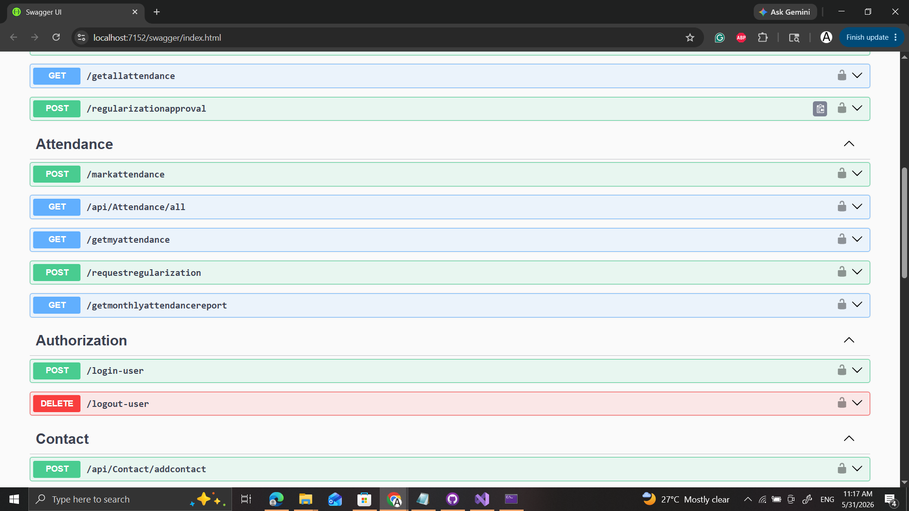
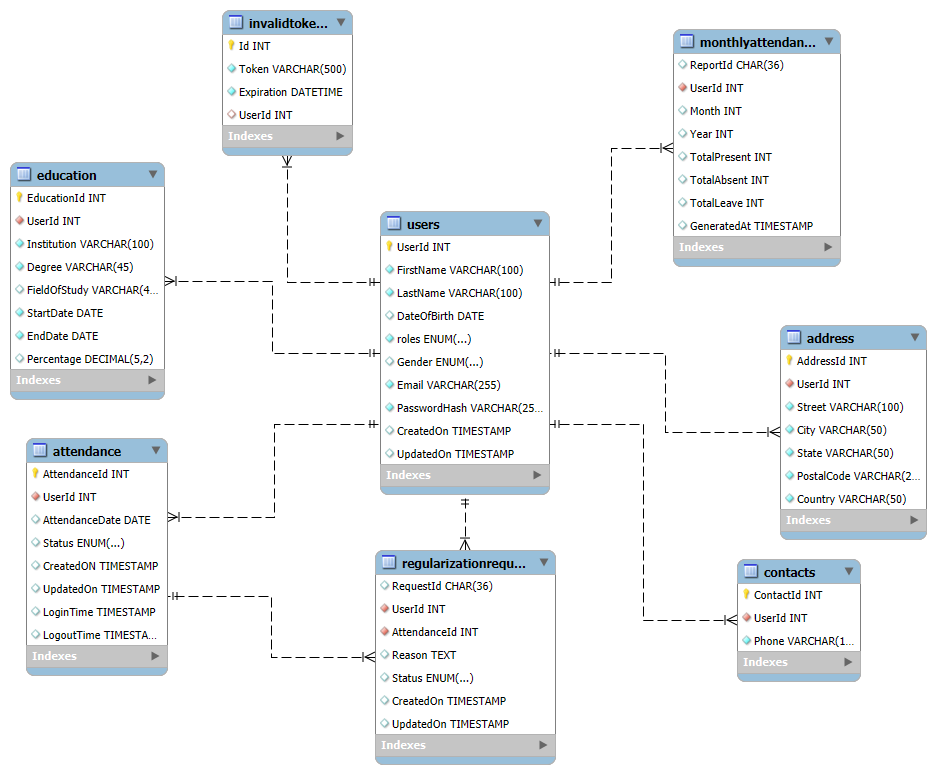

# Attendance Management & Regularization System

## Overview

This project is an enhancement of the User Management System developed in Project 5. It provides a complete Attendance Management and Regularization solution built using ASP.NET Core Web API, Entity Framework Core, MySQL, JWT Authentication, and Role-Based Authorization.

The system enables administrators and users to manage attendance records efficiently while maintaining secure access control through role-based permissions.
## Documentation

Detailed project documentation is available here:

[Process Flow Documentation](Documentation/Process%20Flow%20Documentation.rtf)

## Swagger UI



## Registration Endpoint


## Features

### Authentication & Authorization

* User Registration and Login
* JWT Token-Based Authentication
* Role-Based Authorization (Admin/User)
* Secure Password Hashing
* Change Password Functionality

### User Management

* Create Users
* Assign Roles (Admin/User)
* View User Details
* Update User Information
* Profile Management

### Attendance Management

* Record Attendance
* View Attendance Records
* Manage Attendance User-Wise
* Track Login and Logout Time
* Attendance History Management

### Regularization Management

#### User Features

* View Personal Attendance Records
* Submit Attendance Regularization Requests
* View Submitted Regularization Requests
* Generate Monthly Attendance Reports

#### Admin Features

* View Attendance of All Users
* Create Regularization Requests on Behalf of Users
* View All Regularization Requests
* Approve or Deny Regularization Requests
* Update Attendance Status After Approval
* Generate Monthly Attendance Reports for Any User

### Reporting

* User Monthly Attendance Reports
* Admin Monthly Attendance Reports
* Present/Absent Statistics
* Attendance History Analysis

## Database Tables

### Users

Stores user profile information and role assignments.

### Attendance

Stores daily attendance records including:

* Attendance Date
* Status
* Login Time
* Logout Time

### RegularizationRequest

Stores attendance correction requests submitted by users or administrators.

### MonthlyAttendance

Stores generated attendance reports for specific months.

## Technology Stack

### Backend

* ASP.NET Core Web API
* Entity Framework Core
* MySQL

### Authentication

* JWT Authentication
* Role-Based Authorization

### Design Patterns

* Repository Pattern
* Service Layer Pattern
* Dependency Injection
* Separation of Concerns

## Project Structure

```text
Controllers
│
├── AuthController
├── UserController
├── AttendanceController
├── RegularizationController
├── AdminRegularizationController
│

Services
│
├── Interfaces
├── Implementations
│

Repositories
│
├── Interfaces
├── Implementations
│

DTOs
Models
Data
```

## Key Learning Outcomes

* JWT Authentication & Authorization
* Role-Based Access Control
* Repository Design Pattern
* Entity Framework Core
* ASP.NET Core Web API Development
* Database Design & Relationships
* RESTful API Development
* Clean Architecture Principles

## Future Enhancements

* Email Notifications
* Attendance Dashboard
* Leave Management Module
* Export Reports to Excel/PDF
* Audit Logs
* Real-Time Attendance Monitoring

## Developed By

Anurag Kujur
ASP.NET Core Web API | C# | Entity Framework Core | MySQL
